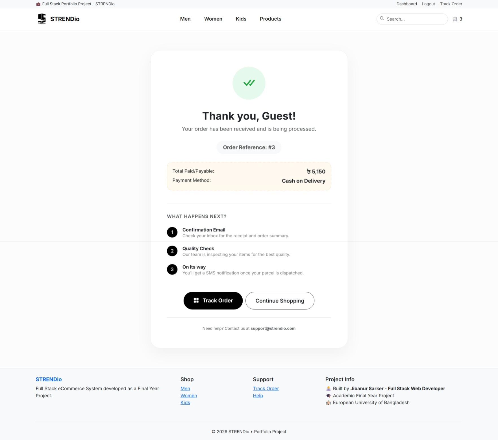
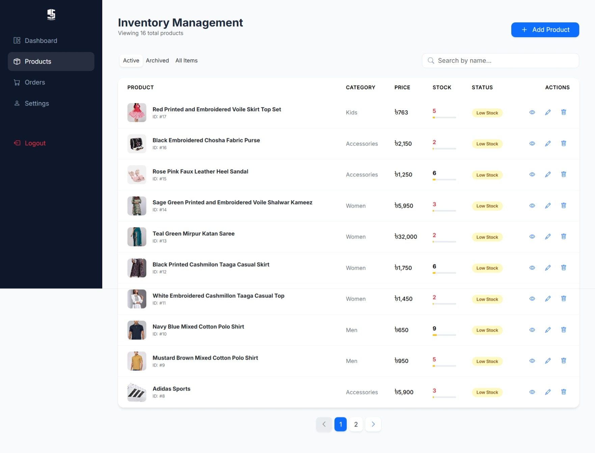

# STRENDio E-Commerce Platform

STRENDio is a full-stack eCommerce web application built using Core PHP and MySQL.  
It provides product browsing, cart system, checkout functionality, and admin management.

---

## Developer

Developed by: Jibanur Sarker  
Role: Full Stack Developer

---

## Features

- Product listing and details view  
- Shopping cart system  
- Checkout with customer information  
- Order management  
- Admin panel (products, categories, orders)  
- Product image upload  
- Responsive design  

---

## Tech Stack

Frontend:
- HTML5  
- CSS3  
- Bootstrap 5  
- JavaScript  

Backend:
- Core PHP  

Database:
- MySQL  

---

## Screenshots

### Home Page


### Product Page


### Product Details Page


### Cart Page


### Checkout Page


### Order Confirm Page


### Admin Dashboard


### Inventory Management Page


---

## ⚙️ Installation Guide

### 1. Clone Repository
```bash
git clone https://github.com/milons2/strendio-ecommerce.git

# Move project to XAMPP
C:\xampp\htdocs\strendio-ecommerce

# Import database
Open phpMyAdmin
Create database: strendio_users
Import file from database/strendio_users.sql

# Run project
http://localhost/strendio-ecommerce

# Admin Access

URL: http://localhost/strendio-ecommerce/admin_login.php

Username: admin
Password: Admin123

### Academic Information

This project was developed as a final year undergraduate project.

Supervisor:
Dr. Mohammad Shaharia Bhuyan
Assistant Professor
Ph.D. in Engineering, Universiti Kebangsaan Malaysia (UKM)
