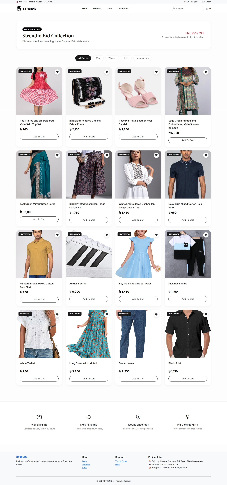
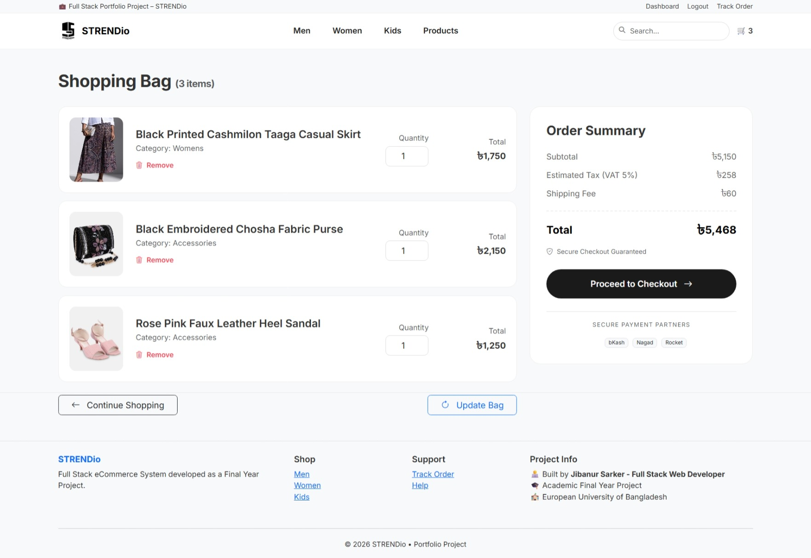
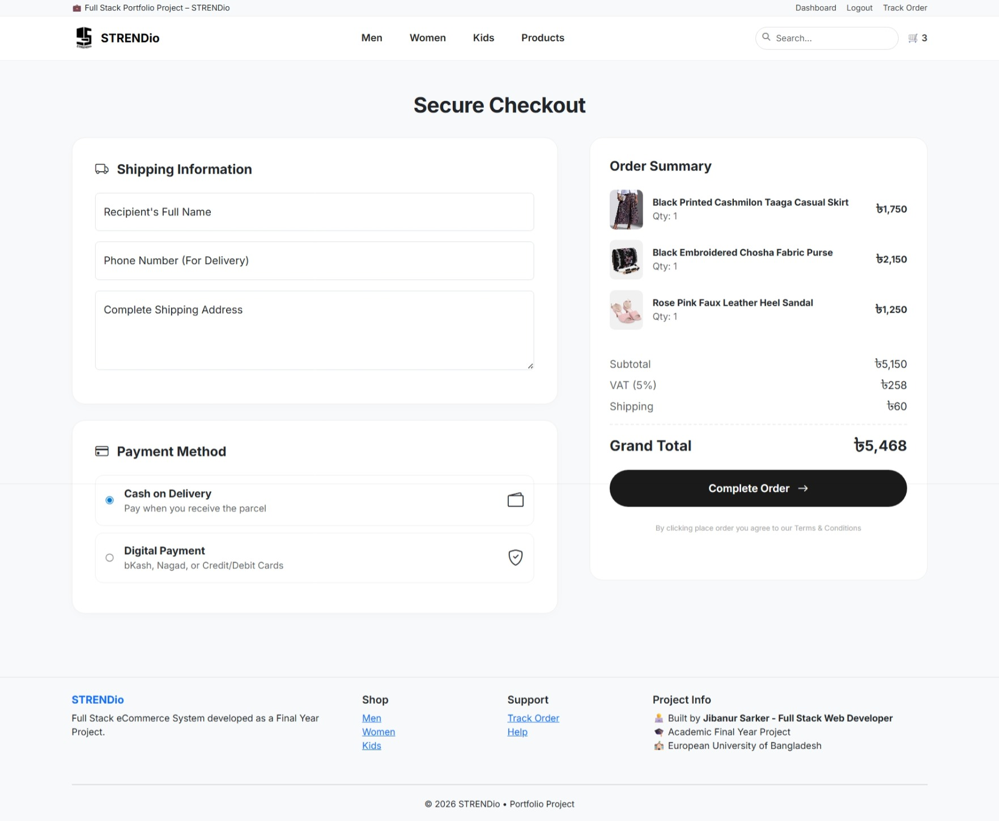
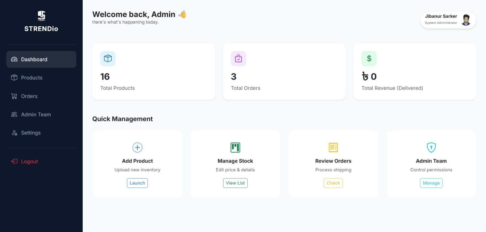

# 🛍️ STRENDio E-Commerce Platform

A full-stack eCommerce web application built with Core PHP and MySQL.  
It supports product browsing, cart system, guest checkout, and admin management.

---

## 🚀 Features

- 🛒 Add to cart (guest & user)
- 💳 Checkout with name, phone, address
- 📦 Order management system
- 🧑‍💼 Admin panel (products, categories, orders)
- 📱 Responsive UI design
- 🖼️ Product image upload system

---

## 🛠️ Tech Stack

- PHP (Core)
- MySQL
- HTML5 / CSS3
- Bootstrap 5
- JavaScript

---

## 📸 Screenshots

### 🏠 Project Portfolio Page


### 🏡 Home Page


### 🛍️ Product Page


### 🛒 Cart Page


### 💳 Checkout Page


### 🧑‍💼 Admin Dashboard


---

## ⚙️ Installation Guide

### 1. Clone Repository
```bash
git clone https://github.com/milons2/strendio-ecommerce.git